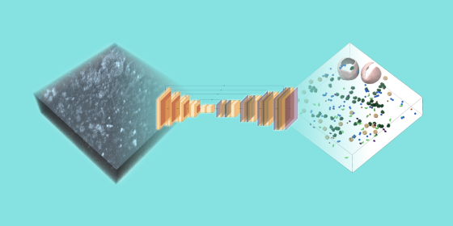
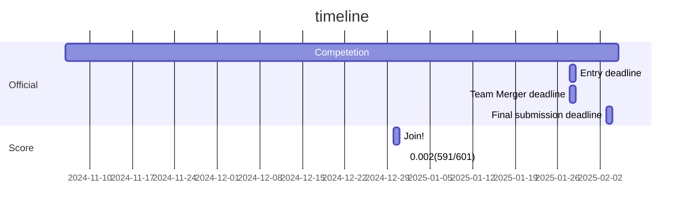
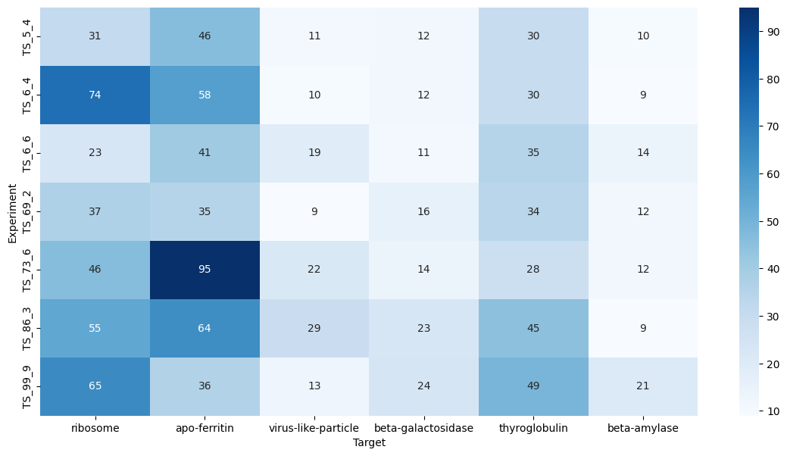
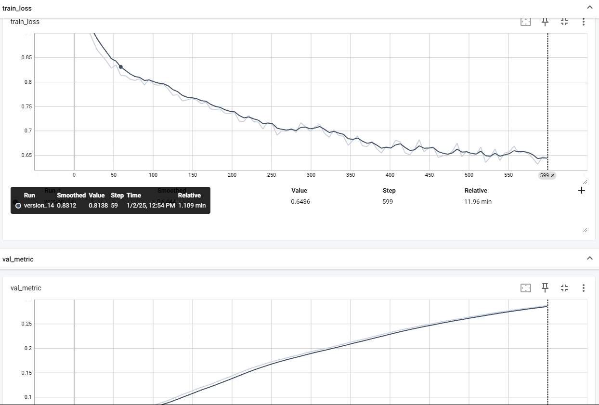

# kaggle-CryoET Object Identification
CryoET Object Identification コンペのリポジトリ

- directory tree
```
kaggle-CryoET Object Identification
├── README.md
├── data         <---- gitで管理するデータ
├── input        <---- コンペで使用するデータ
├── notebook     <---- 作成したノートブック
└── src          <---- .ipynb 以外のコード
```

## Timeline



## Dataset
|Name|Detail|Ref|
|---|---|---|
|---|---|---|

## Paper
|No.|Status|Name|Detail|Date|Url|
|---|---|---|---|---|---|

# コンペティション概要

## **Overview (DeepL翻訳)**
タンパク質複合体（例: 酸素を運ぶヘモグロビン、毛髪のケラチン）は細胞機能に不可欠であり、それらの相互作用を理解することは健康維持や新しい病気治療法の発見にとって重要です。  
クライオ電子トモグラフィ（**cryoET**）は、トモグラムと呼ばれる3D画像を作成する技術であり、細胞の謎を解き明かす可能性を秘めています。

しかし、cryoETによるトモグラムデータはまだ十分に解析されていません。標準化されたフォーマットで公開されている多くのデータ（[cryoETデータポータル](https://cryoetdataportal.czscience.com) 参照）を活用するには、画像内の各タンパク質分子を自動的に同定する必要があります。  
本コンペティションでは、キュレーションされた実世界のcryoETデータセット内にある5つのクラスのタンパク質複合体に自動的に注釈を付ける機械学習（**ML**）アルゴリズムの開発を目指します。

---

## **コンペティションの焦点**
3D断層像の粒子中心に対応する点を特定することが課題です。  
- **提供されるデータ**: 「experiment」と名付けられた3Dアレイリスト  
- **提出形式**: すべての実験における5つの粒子タイプの位置を含むCSV

---

## **data (DeepL翻訳)**

## **粒子タイプ**
データには予測難易度の異なる6種類の粒子タイプが含まれます。

| 粒子タイプ         |英語名| 難易度       |
|---------------------|----|--------------|
| アポ-フェリチン      |apo-ferritin| 簡単          |
| **β-アミラーゼ**    |beta-amylase | 不可能（スコアなし）|
| β-ガラクトシダーゼ  | beta-galactosidase|難しい        |
| リボソーム          |ribosome| 簡単          |
| サイログロブリン    |thyroglobulin|難しい        |
| ウイルス様粒子      |virus-like-particle| 簡単          |

### **注意事項**
- **β-アミラーゼ**は正確な評価が難しいため、スコアに含まれません。ただしデータには含まれています。

---

# ファイル情報

## **train/**
- **static/ExperimentRuns/{experiment}/VoxelSpacing10.000/**  
  - `denoised.zarr/` : トモグラフィーデータを含む zarr ファイル  
  - `{3つの他のフィルタリングされたオプション（テストには含まれない）}`

- **overlay/ExperimentRuns/{experiment}/Picks/**  
  - `{particle_type}.json` : 粒子の座標を含む真値ファイル  

## **test/**
- **static/ExperimentRuns/{experiment}/VoxelSpacing10.000/**  
  - `denoised.zarr/` : トモグラフィーデータを含む zarr ファイル  
- `sample_submission.csv` : 正しいフォーマットの提出用ファイル  

**テストデータの特徴:**
- このページに示されるテストデータセットは、トレーニングデータからコピーされたサンプルデータです。
- 再実行用テストデータセットには約500のトモグラフが含まれています。

---

# トモグラフについて

## **形式とライブラリ**
トモグラフは **3D配列** であり、**マルチスケールの3D OME-NGFF Zarr配列** として提供されます。  
以下のライブラリを使用して操作可能です：
- **zarr**
- **ome-zarr**
- **copick**

## **トレーニングデータのフィルタリングオプション**
トレーニングデータには、以下の4種類のフィルタリングされたトモグラフが提供されています。  
（**テストデータには「denoised」のみが含まれます**）

1. **denoised**（テストデータに含まれる唯一のトモグラフタイプ）  
2. **wbp**（weighted back projection）  
3. **ctfdeconvolved**  
4. **isonetcorrected**

---

## **補足情報**
- **zarr ファイルの解像度**: `0` が最も高解像度を意味します。
- **copick の利用**: ラベルとの関連を維持しながら zarr ファイルを操作することができます。詳しくはピン留めされたノートブックをご確認ください。

## Log
### 20241230
- join!!
- kaggle日記作成！
- 現在出来てること
  - 環境構築
  - 既存の学習済みファイルを使って提出ファイルの作成


### 20241231
- データ内容の理解をしたい(exp001.ipynb)
  - 長方形の3Dデータ
  - 7実験　630x630x184
  - Z軸に伸びてるのが気になる
# 実験毎のターゲットの数


### 20250101
- 手法としてYOLOを用いるやり方と,U-netを用いる方法と2種類ある
  - YOLOのnotebook
  https://www.kaggle.com/code/itsuki9180/czii-yolo11-training-baseline
  - Unetのnotebook
  https://www.kaggle.com/code/hengck23/1-hr-fast-2d-3d-unet-resnet34d-scanner-tta

- 精度はUnetのほうが出そう
- Unetのエンコーダーが3種類あってどれがいいか
- とりあえずケロッピ先生のUnetの実装を再現する
  - https://www.kaggle.com/code/hengck23/1-hr-fast-2d-3d-unet-resnet34d-scanner-tta/notebook
  
  
環境確認ファイルをanalyze/env.ipynbに作成

ケロッピ先生のcodeを全部読む
|Name|URL|Detail|Ref|
|---|---|---|---|
|3d-unet using 2d image encoder|https://www.kaggle.com/code/hengck23/3d-unet-using-2d-image-encoder|---|---|
|speed up connected component analysis with pytorch|https://www.kaggle.com/code/hengck23/speed-up-connected-component-analysis-with-pytorch|---|---|
|random submission|https://www.kaggle.com/code/hengck23/random-submission|---|---|
|1 hr fast 2d/3d-unet resnet34d scanner tta|https://www.kaggle.com/code/hengck23/1-hr-fast-2d-3d-unet-resnet34d-scanner-tta|---|---|

(追記)多分実装難しいからベースラインから再現する
- https://www.kaggle.com/code/ahsuna123/3d-u-net-training-only
- https://www.kaggle.com/code/zhuowenzhao11/3d-u-net-pytorch-lightning-distributed-training

### 20250102
一番基本的な実験は再現できたっぽい　baseline-unet-train-submit.ipynb

CVが高めに出た？ 0.5615457336044762

学習の可視化

改善点
- コンペの指標が反映されてない
- エポック数,バッチサイズ
- 切り出しサイズ
- エンコーダー,デコーダー
- アーキテクチャは最適化？
- 学習しきってないのでは？
- 入力の形

ケロッピ先生の学習のログで必要なもの
- 
- 
### 20250104
とりあえず
resnet2dでエンコード

↓

Unet3dでデコードを試す

002Unet+rasnet.ipynb

# 20250105

run_check_netは通ったけど実際にデータ用意すると通らん

GPUメモリがギリギリだからマルチGPUに手を出す必要がありそう

他のノートブック読んでデータの扱いを見直す

# 20250110

モデルの学習→推論の流れは完成

GPUを使うとlossが収束しない notebook003

マスクは周辺1マスにしないといけない exp005


# 20250111
どうやっても収束しない

可視化のコードを書いた007~009

マスクの適用にバグがあった

データ拡張をちゃんと考える

# 20250116
どうやっても収束しない(以下略)

# 20250119
ケロッピ先生の実験再現をしたい

分かってること
- 3d-unet using 2d image encoderのコードを使用
- 少なくともLB 0.635
- onhotマスクを使用してクロスエントロピー誤差を使用
- resnet18(34)dのアーキテクチャが使われてる
- 1スライスは640 * 640 * 32
- バッチサイズは3でデータ数は6サンプル278個　62 gbメモリ消費
- 何もしなかったら1サンプルあたり11個なので4.6倍にデータ水増ししてる
- epoch_optimizer_resetは5,10
- optimizerはAdamW　lr: 0.001~0.0001　weight_decay: 0.01
‐ 学習率0.001で22エポック,0.0001で17エポック

これの再現を015.ipynbでやる

今後の戦略(あと18 days)

- LB0.707の公開アンサンブルノートブックのUnetの置き換え
- ttaを実装できたら0.75は出る
- しきい値の調整